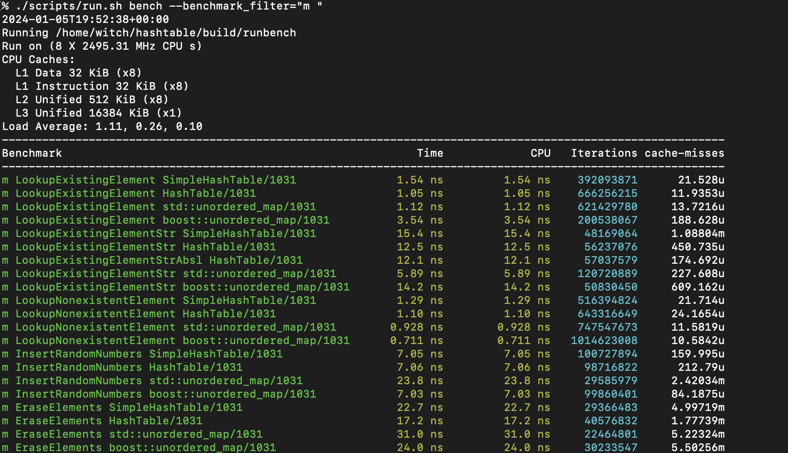

high performance (simple) hash table
===

WIP

* low memory footprint 
* fast (cache-friendly data structure)
* support for move-only and non-default constructor kv
* syntactically similar interface compared to `unordered_map`

more documentation is in `docs`.


dependencies
---

Tested on Ubuntu 22.04

benchmarking:

```sh
# install boost and libpfm
sudo apt-get install libboost-all-dev libpfm4-dev
# ensure libpfm can read perf events
sudo sh -c 'echo 0 > /proc/sys/kernel/perf_event_paranoid'
```

for more information about `perf_event_paranoid`, see ee [kernel docs on perf security](https://www.kernel.org/doc/html/latest/admin-guide/perf-security.html)

google benchmark is installed through cmake.

unit tests:

google test is installed through cmake.


usage
---

in short, `build.sh` builds the benchmarking, examples, and unit tests and dependencies, and `run.sh` runs them.

build options:

```sh
./scripts/build.sh                    # builds tests, examples, and benchmarking (everything)
./scripts/build.sh examples           # builds the examples that use the hash table library
./scripts/build.sh bench              # builds the benchmarking suite which uses the hash table library, a simple version, and other deps. uses googlebenchmark
./scripts/build.sh tests              # builds the unit tests using the hash table library. uses googletest
```

run options:


```sh
./scripts/run.sh                        # runs the tests, examples, and bench in that order
./scripts/run.sh examples               # runs the examples
./scripts/run.sh bench                  # runs the benchmarking suite, with additional arguments passed to google benchmark
./scripts/run.sh benchgraph             # runs the benchmarking suite and produces graphs of the results, using python and matplotlib
./scripts/run.sh tests                  # runs the unit tests
```

any additional arguments supplied after `bench` will be passed as CLI arguments to google benchmark, see the [user guide](https://github.com/google/benchmark/blob/main/docs/user_guide.md). for example,




only performs the benchmarks whose name matches that regex pattern, in this case for benchmarks on the medium number of buckets (name prepended by m-space)


benchmarking
---
 
this hash table has been benchmarked against a simple hash table, std::unordered_map, and boost::unordered_map with google benchmark. python scripts use matplotlib to generate plots of this data.

the `bench/` directory contains the tools necessary for this. See `docs/benchmarking.md`
